# Bootstrapping

A compiler is characterized by three languages:

1.  Source Language
2.  Target Language
3.  Implementation Language

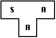

1. *Notation*: 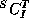 represents a compiler for Source _S_, Target _T_, implemented in _I_. The _T-diagram_ shown above is also used to depict the same compiler.

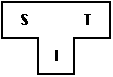

To create a new language, L, for machine A:

2.  Create 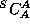 , a compiler for a subset, S, of the desired language, L, using language A, which runs on machine A. (Language A may be assembly language.)

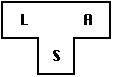
    
3.  Create 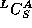 , a compiler for language L written in a subset of L.

4.  Compile  using  to obtain 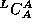 , a compiler for language L, which runs on machine A and produces code for machine A.
    

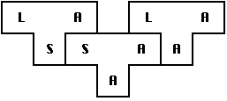

The process illustrated by the T-diagrams is called _bootstrapping_ and can be summarized by the equation:

To produce a compiler for a different machine B:

1.  Convert  into 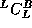 (by hand, if necessary). Recall that language S is a subset of language L.
2.  Compile  to produce 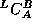 , a _cross-compiler_ for L which runs on machine A and produces code for machine B.
3.  Compile  with the cross-compiler to produce 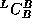 , a compiler for language L which runs on machine B.

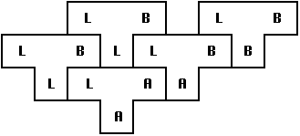

* * *

_CS 631 Class Account  
Thu Sep 14 11:55:16 ADT 2000_